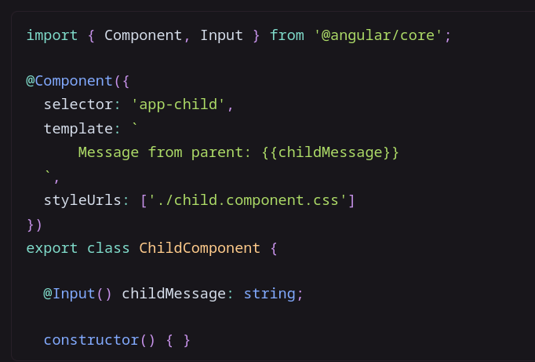

# Tipos de comucación entre componentes padres a hijos

## Teoría
- ### Comunicación desde el componente hijo al Padre mediante ViewChild
Consiste en usar la etiqueta @Input de Angular. Ésta etiqueta se pone en el componente hijo para indicar que esa variable proviene desde fuera del componente, es decir desde el componente padre.
A esto se en otros frameworks como Vue se le suele llamar props. Con esto vas a poder tener un componente que sea configurable pudiendo pasar datos al usarlo.

**Mediante ViewChild, el padre crea el componente hijo y tiene acceso a sus datos y atributos:**

---

---
La particularidad de éste método es que tenemos que esperar a que la vista esté totalmente cargada para acceder a los atributos del hijo. Para ello creamos un método de Angular llamado ngAfterViewInit() en el que simplemente inicializamos la variable con el valor del atributo del hijo (el hijo lo declaramos como @ViewChild(ChildComponent)).

- ### Comunicación entre componente Padre al hijo mediante outputs y eventos:
Éste método es útil cuando queremos queremos informar de cambios en los datos desde el hijo, por ejemplo, si tenemos un botón en el componente hijo y queremos actualizar los datos del padre.
---

--- 

## Reflexión

@Input() es perfecto para pasar datos de configuración y propiedades al componente hijo, manteniendo un flujo de datos claro Y preciso.

@ViewChild() es poderoso para situaciones donde se requiere acceso directo a las funcionalidades del componente hijo, aunque debe usarse con precaución para mantener el encapsulamiento.

@Output() y eventos ofrecen una forma elegante de manejar la comunicación desde el hijo al padre, promoviendo un diseño basado en eventos que es fácil de mantener y escalar. 

## Analogía: *WHIPLASH!: Not quite my TEMPO!*

- **@Input():** El director (padre) entrega una hoja de instrucciones (datos) aL BATERISTA (hijo). El baterista sigue estas instrucciones para tocar sus partes correctamente. Este es un flujo claro de información, donde el director configura lo que cada músico debe hacer.

- **@ViewChild():** El director (padre) se acerca directamente a BATERISTA (hijo) y le pide que toque una nota (método o propiedad). El director puede entonces ajustar lo que está haciendo el músico en tiempo real. Esto requiere que el director esté presente y prestando atención ni gritando por el maldito tempo, y solo puede hacerlo después de que la orquesta ha comenzado a tocar (después de ngAfterViewInit).

- **@Output() y Eventos:** El BATERISTA (hijo) toca *CARAVAN* (emite un evento) para informar al director (padre) de un problema o cambio de repertorio por enojo (datos). El director ve la señal y responde ajustando el plan según la bateria siendo tocada. Esto permite que los músicos comuniquen información importante al director sin que él tenga que estar supervisando cada detalle constantemente.

## Resumen
Comunicación del Padre al Hijo con @Input():
        Uso: Para pasar datos del componente padre al componente hijo.
        Método: Se utiliza el decorador @Input() en el componente hijo para recibir los datos.
        Ventajas: Simple y directo, ideal para configurar componentes hijos.

Comunicación del Hijo al Padre con @ViewChild():
        Uso: Para que el componente padre acceda directamente a métodos y propiedades del componente hijo.
        Método: Se usa el decorador @ViewChild() en el componente padre para obtener una referencia al componente hijo.
        Ventajas: Permite un control directo y detallado, útil para interacciones en tiempo real.

Comunicación del Hijo al Padre con @Output() y Eventos:
        Uso: Para que el componente hijo notifique al componente padre sobre cambios o eventos.
        Método: El componente hijo emite eventos utilizando @Output() y EventEmitter, que son escuchados por el componente padre.
        Ventajas: Mantiene un buen encapsulamiento y permite una comunicación reactiva y desacoplada.

Conclusión

@Input(): Configuración inicial del hijo por el padre.
@ViewChild(): Acceso directo del padre a las funcionalidades del hijo.
@Output() y Eventos: Notificación de eventos del hijo al padre.

## REFERENCIAS:
*Aprende a comunicar componentes entre sí con Angular:*<https://codingpotions.com/angular-comunicacion-componentes/>

*Comunicación entre componentes de Angular:* <https://youtu.be/df0eH9mM9nU?si=Gm5jo-6gOhygdh4d>

### VIDEO EN YOUTUBE:
**Link:** <>